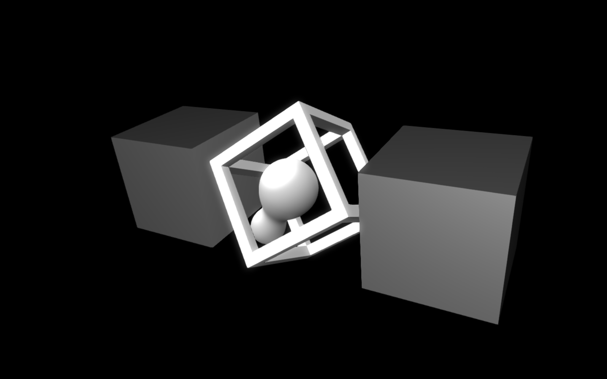

# Gridshape Raymarcher
# Simplex Noise Loop

#### 📟 [See more visuals and code!](http://gumroad.com/tmhglnd)

#### 🙏 [Support me on Patreon!](https://www.patreon.com/bePatron?u=9649817)

In this repository you'll find an example on how to use a ray marcher as shading for a `jit.gl.gridshape` and have it be part of the jitter world using the same camera as the other objects. Inspired and ported from the great Art of Code tutorial about using GLSL shading on a cube in Unity. With some help by Jaromir Mulders. sdf compositing and shape primitives functions from the GL3 package examples, which are taken from Inigo Quilez.



# Resources

- [The Art of Code - Writing a ray marcher in Unity](https://youtu.be/S8AWd66hoCo)
- [Inigo Quilez - Distance Functions](https://www.iquilezles.org/www/articles/distfunctions/distfunctions.htm)

# Usage

Download zip
```
1. download zip
2. unzip
```
Git clone
```
1. $ cd ~/Documents/Max\ 8/Library
2. $ git clone https://github.com/tmhglnd/simplex-noise-loop.git
```

```
3. Open the cube-raymarcher.maxpat
4. Follow the instructions
5. Open the cube-raymarcher.jxs to see the code
6. Read the comments
```

# License

The MIT License
